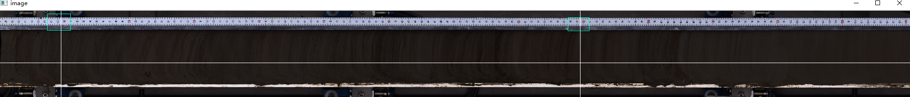
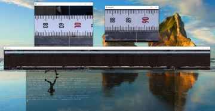

# Parse_RGB

Introduction
------------
this is a tool to extract R、G、B and Gray value in Core image, which one can choose bottom and top well depth. output column are: well depth、 R、G、B and Gray.

Requirement
------------
1. python3 later is recommend

How to use
-------------
run the following code in the same directory with the extracted image.
```bash
python Parse_RGB.py
```
There are some parameters and tricks you should care about:
 - input number
 - drawing mode
 - input well depth
 
 NOTES: 
 Input number can be one or two parameters, first one means the image name, second means hwo many numbers you wanna output in this well depth coordinate. If the second value is less than 65536 and polt the figure of R\G\B\Gray curve, result will be saved in xls, then saved in txt.
 There are two methods you can choose in drawing mode: 'r'(rectangle) and 'p'(point). when the "image" named window shows on your screen, you can chooce 'r' or 'p', if you choose 'p mode, you can only point 3 times in the "image" picture, the first time will show a horizontal line which means the what core line you canna parse, the second and the third time will show two vertical lines which means the bottom and top well depth. if you cannot see clearly the well depth in the "image" window, you should choode the 'r'mode, in this mode, you can need to click 4 points in the "image" window, the fisrt two points means the left rectangle you need to zoom in, last two points means the right rectangle you need to zoom in, after that, there will show the other two windows on the screen: "img_ori1" and "img_ori2", you need to click a point in these windows, it means the bottom and top well depth you choose, after that, you need to click 'q' to go back to the "image" window, after that, you need to click 'p', then click a point in the "image" window it will show a horizontal line which means the what core line you canna parse.
 Input well depth parameters are two Input parameter you should enter after the draing process, which means the coordinate transformation you wanna output.
 
## Examples (Left: input, Right: output)
<p>
    
    
</p>
Code style
-------------
We adopt [PEP8](https://www.python.org/dev/peps/pep-0008/) as the preferred code style，please check your new code by pylint.


For Developer
-------------


